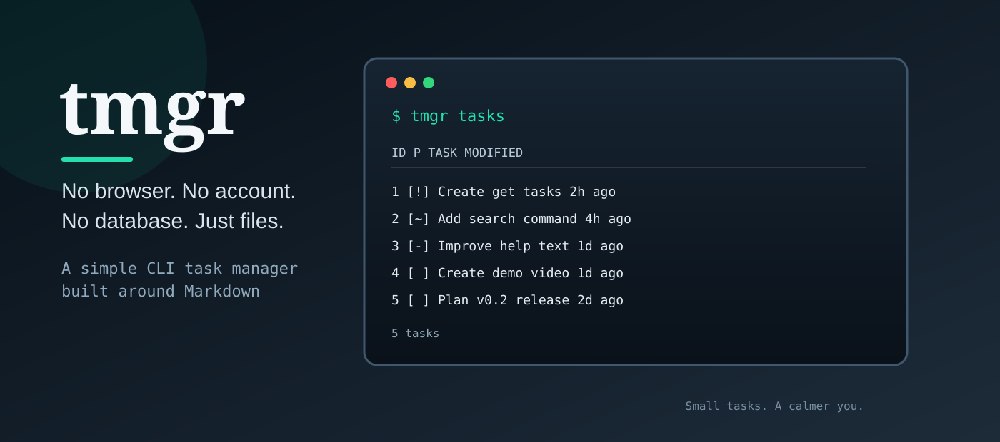

# tmgr



`tmgr` is a small cross-platform command-line task manager built with .NET. It stores tasks as plain Markdown files, so they are easy to read, edit, and keep under version control.

## Installation

Download the archive for your platform from the [latest GitHub release](https://github.com/RudiStorm/tmgr/releases/latest), extract it, and add the extracted directory to your `PATH`.

The release packages are self-contained and do not require a separate .NET installation.

## Usage

Run `tmgr` from the directory where you want to store tasks.

### Initialize a directory

```sh
tmgr init
```

This creates a `tmgr_tasks` directory. Running the command again reports that the directory is already initialized.

### Create a task

```sh
tmgr new "Plan release" "Build and publish the release packages"
```

The command creates a timestamped directory under `tmgr_tasks` containing a `task.md` file. The title and description are required arguments.

### List open tasks

```sh
tmgr tasks
```

Tasks with `Completed: false` are displayed in descending priority order. Completed tasks are omitted.

The command displays open tasks in a compact table. The `P` column uses `[!]` for priority 1000 or higher, `[~]` for priority 500-999, `[-]` for other positive priorities, and `[ ]` for zero or negative priorities. Task rows link to their Markdown files in terminals that support hyperlinks.

```text
 ID  P   TASK                                      MODIFIED
--- --- ----------------------------------------- --------
  1 [!] Create get tasks                           2h ago
  2 [-] Sample Task                                1d ago
```

## Task format

Tasks are plain Markdown files with metadata near the top:

```text
# Plan release
------------------------------
- Priority: 50
- Completed: false
- Tags: [release,cli]
------------------------------
Build and publish the release packages
```

You can edit `Priority` and `Completed` directly. Set `Completed` to `true` to hide a task from `tmgr tasks`.

## Building from source

Requirements:

- .NET SDK 10.0 or later

Build and run the project with:

```sh
dotnet build
dotnet run -- init
dotnet run -- tasks
```

To publish a local release binary for the current platform:

```sh
dotnet publish -c Release
```

## License

No license has been specified yet.
